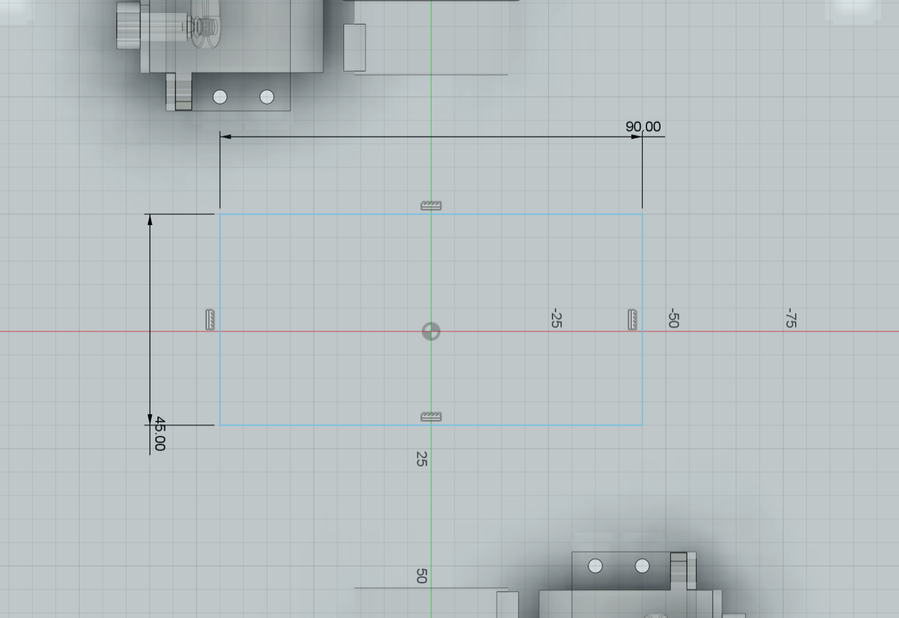

# Week 3 CAD 页面更新记录

## 📅 更新时间
2026年6月12日

##  更新内容

### 1. 标题统一修改
将所有"CAD小车建模练习"相关标题改为简洁的"CAD"：

| 位置 | 原内容 | 新内容 |
|------|--------|--------|
| `<title>` 标签 | `Week 3 - CAD练习` | `Week 3 - CAD` |
| 页面主标题 | `CAD练习` | `CAD` |
| 项目介绍段落 | `CAD 小车建模练习` | `CAD 建模练习` |
| 导航按钮 | `Week 3 - CAD` | `Week 3 - CAD`（保持不变） |

### 2. 图片详细介绍添加

在**阶段一：座位结构设计**部分，为 c5-c8 四张图片添加了详细的步骤说明：

#### c5.png - 创建草图
```html
<p class="image-description">步骤1：创建草图。在 Fusion 360 中选择合适的工作平面，使用线条工具绘制座椅的基础轮廓，确定整体形状和比例关系。</p>
```

**说明要点：**
- 选择工作平面
- 使用线条工具绘制轮廓
- 确定形状和比例关系

#### c6.png - 创建图形并标注尺寸
```html
<p class="image-description">步骤2：创建图形并标注尺寸。为草图中的关键部位添加尺寸约束，确保座椅的宽度、深度和高度符合设计要求，建立精确的尺寸体系。</p>
```

**说明要点：**
- 添加尺寸约束
- 确保宽度、深度、高度符合要求
- 建立精确的尺寸体系

#### c7.png - 拉伸成型
```html
<p class="image-description">步骤3：拉伸成型。将二维草图沿垂直方向进行拉伸操作，生成三维实体结构，形成座椅的基本形态和厚度。</p>
```

**说明要点：**
- 二维草图转三维实体
- 沿垂直方向拉伸
- 形成基本形态和厚度

#### c8.png - 约束后的草图优化
```html
<p class="image-description">步骤4：约束后的草图优化。对草图添加几何约束（如平行、垂直、相切等），确保各部分之间的位置关系准确，提高模型的稳定性和可编辑性。</p>
```

**说明要点：**
- 添加几何约束（平行、垂直、相切等）
- 确保位置关系准确
- 提高模型稳定性和可编辑性

### 3. CSS 样式美化

为图片描述文字添加了专属样式 `.image-description`：

```css
.image-description {
    background: linear-gradient(135deg, #fff9e6 0%, #fffef5 100%);
    border-left: 4px solid #f5a623;
    padding: 12px 15px;
    margin-bottom: 10px;
    font-size: 14px;
    line-height: 1.6;
    color: #5a4a3a;
    border-radius: 0 8px 8px 0;
    box-shadow: 0 2px 8px rgba(245, 166, 35, 0.1);
}

.image-description::before {
    content: "💡 ";
    font-size: 16px;
}
```

**样式特点：**
-  **渐变背景**：浅黄色到米白色的渐变，与页面主题色协调
-  **左侧边框**：4px 橙色边框，突出显示
- 💡 **图标前缀**：自动添加灯泡 emoji，增强视觉效果
- 📱 **响应式设计**：移动端字体缩小至 13px，padding 调整
- ✨ **圆角设计**：右侧圆角，左侧直角，形成视觉引导
- 🌟 **阴影效果**：轻微阴影增加层次感

## 📋 完整的建模流程说明

现在阶段一的四个步骤形成了完整的建模流程：

1. **创建草图** → 绘制基础轮廓
2. **标注尺寸** → 建立精确尺寸体系
3. **拉伸成型** → 生成三维实体
4. **约束优化** → 提高模型稳定性

这个流程体现了 Fusion 360 的标准建模方法，从二维到三维，从粗略到精确。

## ✨ 更新亮点

1. **标题简洁化**：去除冗余的"小车建模练习"字样，使标题更简洁专业
2. **步骤清晰化**：每张图片都有明确的步骤编号和详细说明
3. **视觉层次化**：通过 CSS 样式区分图片说明和普通文本
4. **学习价值提升**：详细的步骤说明有助于学习者理解 CAD 建模的逻辑流程
5. **风格一致性**：新增样式与 week5.html 的风格保持一致（低饱和度配色）

## 🔍 技术细节

### HTML 结构调整
```html
<!-- 之前 -->
<div class="image-illustration">
    
    <p>座位草图 1</p>
</div>

<!-- 之后 -->
<div class="image-illustration">
    <p class="image-description">步骤1：创建草图。...</p>
    
    <p>座位草图 1</p>
</div>
```

### 样式继承关系
- `.image-description` 位于 `.image-illustration` 内部
- 继承了父容器的布局和间距
- 不影响原有的图片点击放大功能

## ✅ 验证清单

- [x] 所有"CAD小车建模练习"标题已改为"CAD"
- [x] c5.png 添加了创建草图的详细介绍
- [x] c6.png 添加了标注尺寸的详细介绍
- [x] c7.png 添加了拉伸成型的详细介绍
- [x] c8.png 添加了约束优化的详细介绍
- [x] CSS 样式已添加到 `<head>` 中
- [x] 样式包含响应式设计
- [x] 图片点击放大功能正常工作
- [x] 页面排版保持美观

## 📝 注意事项

1. **其他图片未添加说明**：目前只为 c5-c8 添加了详细介绍，c9-c17 等其他图片仍保持原有格式
2. **可扩展性**：如需为其他图片添加说明，可复制 `.image-description` 样式和 HTML 结构
3. **颜色协调**：使用的橙黄色（#f5a623）与 week5.html 的主题色保持一致
4. **字体大小**：桌面端 14px，移动端 13px，确保可读性

## 🎨 设计思路

本次更新遵循以下设计原则：

1. **信息层级清晰**：通过颜色、边框、图标区分不同类型的信息
2. **学习导向**：强调步骤编号和操作要点，便于学习者跟随
3. **视觉舒适**：使用低饱和度配色，避免刺眼的颜色
4. **专业感**：简洁的标题和规范的步骤说明提升专业度
5. **一致性**：与项目中其他页面的设计风格保持统一
